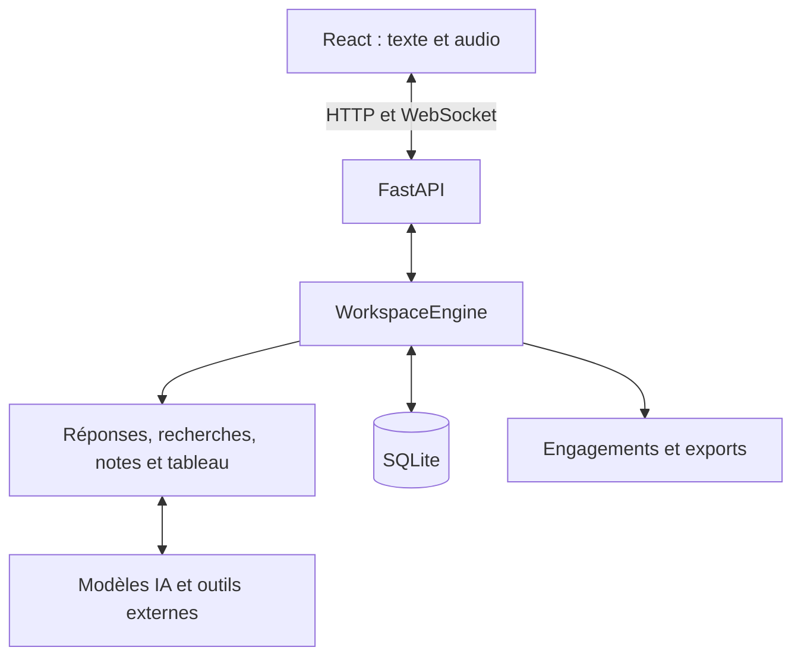

# Architecture

Atlas2 utilise un frontend React, un serveur FastAPI et un moteur d’agents. Le serveur sert aussi l’interface compilée.

## Organisation du code

| Dossier ou fichier | Rôle |
| --- | --- |
| `frontend/src/` | Interface, capture audio, lecture vocale et connexion au serveur |
| `src/aparte/workspace/api/` | Routes HTTP, messages WebSocket et contrôle d’accès |
| `src/aparte/workspace/runtime.py` | Consentement, sessions et engagements |
| `src/aparte/workspace/core/` | Orchestration, réponses, recherches, notes et tableau |
| `src/aparte/workspace/adapters/` | Voix, routage, connecteurs et stockage SQLite |
| `src/aparte/workspace/integrations.py` | Enregistrement des outils de recherche |
| `src/aparte/providers.py`, `weather.py`, `pipelex_workflow.py` | Recherche web, Dust, météo et comparaisons |
| `src/aparte/minutes.py` | Citations, validation des actions et exports |
| `tests/`, `scripts/` | Tests, installation, diagnostics et préparation de la remise |

## Déroulement d’un échange

1. L’utilisateur démarre une session avec accord des participants. Le texte saisi ou transcrit rejoint la conversation.
2. Le moteur détermine s’il faut mémoriser, répondre ou lancer une recherche. Les recherches peuvent avancer pendant que la conversation continue.
3. Les résultats alimentent les réponses, les notes et le tableau. La voix est diffusée progressivement et peut être interrompue.
4. Les engagements proposés citent les échanges d’origine. L’utilisateur confirme le responsable et la date avant l’export calendrier.
5. La pause arrête la capture et annule les travaux. Une session rouverte ou reconnectée reste en pause jusqu’à confirmation.

`WorkspaceEngine` étend le moteur Atlas. TypeSafe assure le routage lorsqu’il est configuré ; sinon, le modèle prend le relais. OpenAI traite la conversation et les recherches, Gradium la voix. Les autres outils sont activés selon la configuration.

Le navigateur surveille séparément le microphone et l’onglet de réunion pour céder la parole aux participants. Une invitation ou une question adressée à Atlas autorise une réponse après la fin du tour. Une aide clairement attendue par le groupe autorise une réponse brève après trois secondes de silence continu, annulée si quelqu’un reprend. Une pause seule ne suffit pas. Les interventions spontanées sont espacées d’au moins 90 secondes ; les demandes explicites restent possibles.

## Mémoire et configuration

- L’état actif contient la transcription, les notes, les cartes et les tâches.
- `.data/aparte.sqlite3` conserve les sessions et leur journal. L’audio brut n’y est pas enregistré.
- Chaque agent reçoit le contexte utile à son rôle. Le stockage local n’est pas chiffré et ce contexte est transmis aux fournisseurs sollicités.
- `.data/config.json` règle les modèles et les fournisseurs. Les clés restent dans l’environnement, `.env` ou `.Secrets`.
- `APARTE_DATABASE_PATH` permet de déplacer la base. Pour une sauvegarde manuelle, arrêter le serveur avant de la copier.

## Contrat et accès

Le serveur écoute sur `127.0.0.1:8765`. Une session active et un onglet de contrôle sont autorisés par serveur. Les messages sont définis dans `workspace/api/schemas.py`, puis exportés en OpenAPI et TypeScript.

Dans un appel externe, Atlas capture l’audio de la réunion ; la réunion doit partager l’onglet Atlas avec son audio pour diffuser ses réponses. Voir le [guide audio](docs/demo-video.md).
