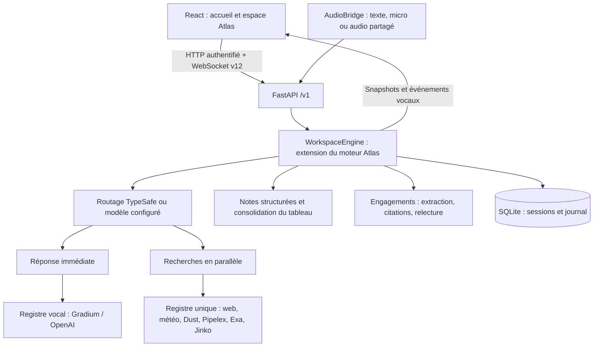
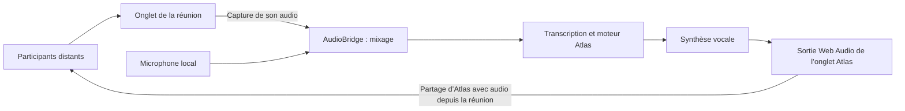

# Architecture effective d’Atlas dans le dépôt Aparté

Référence : [Atlas `4e0823f`](https://github.com/KpihX/atlas/tree/4e0823f8f4350978d94a69d3e16fa06c2b3584fa), branche `kpihx-ubuntu`. Ce document décrit le code exécuté ici. Le `CONTRACT.md` amont comprend aussi des objectifs de développement ; ils ne sont pas tous implémentés.

## Une seule chaîne d’exécution

Le processus lancé par `aparte.app` contient une seule instance de `WorkspaceEngine`. Cette classe hérite d’`AtlasEngine` et ajoute consentement, persistance compatible et engagements. L’héritage ne crée pas un second moteur. Aucun service de réunion native ni ancienne interface n’est monté.

## Responsabilités

| Emplacement | Responsabilité |
|---|---|
| `frontend/src/App.tsx` | Assemblage du parcours et des vues |
| `frontend/src/hooks/useAtlas.ts` | Bootstrap, connexion, commandes, capture, lecture et sous-titres |
| `frontend/src/components/SessionHome.tsx` | Démarrage et bibliothèque |
| `frontend/src/components/SessionControls.tsx` | Pause visible et commandes secondaires dans un menu |
| `frontend/src/components/WorkflowCanvas.tsx` | Graphe des agents sur grand écran, cartes sur petits écrans |
| `frontend/src/components/MinutesView.tsx` | Citations, relecture, responsables, échéances et exports |
| `frontend/src/components/ResearchTasks.tsx` | État, durée mesurée et annulation des recherches dans l’inspecteur existant |
| `frontend/src/audio.ts` | Capture, mixage, PCM, interruption et libération des appareils |
| `src/aparte/workspace/api/` | API HTTP, validation des messages et diffusion WebSocket |
| `src/aparte/workspace/runtime.py` | Règles locales : consentement, arrêt, reprise et engagements |
| `src/aparte/workspace/core/` | Orchestration Atlas, modèles, réponse, mémoire, tableau et outils |
| `src/aparte/workspace/adapters/` | Registres STT/TTS Gradium/OpenAI, TypeSafe, Exa, Jinko et SQLite |
| `src/aparte/workspace/echo.py` | Filtrage conservateur des répétitions d’une voix récemment jouée, avant mémoire et routage |
| `src/aparte/workspace/integrations.py` | Enregistrement des fournisseurs d’Aparté dans le registre Atlas |
| `src/aparte/providers.py`, `weather.py`, `pipelex_workflow.py` | Recherche web et adaptateurs spécialisés |
| `src/aparte/minutes.py` | Contrôle des citations, versionnement et exports Markdown/iCalendar |

## Déroulement d’une intervention

1. Le navigateur obtient la configuration publique et une capacité locale via `/v1/bootstrap`. Il transmet la capacité dans le premier message WebSocket, jamais dans l’URL.
2. Le démarrage exige un booléen de consentement explicite. En mode texte, aucun appareil audio n’est ouvert. En audio, les échantillons sont envoyés au fournisseur STT actif et les interventions finales rejoignent la même transcription.
3. Le moteur enregistre l’intervention, incrémente l’époque de conversation et demande un routage catégoriel : ignorer, mémoriser, répondre, rechercher, agir ou contrôler. TypeSafe est utilisé s’il est configuré ; un modèle prend le relais, puis un comportement conservateur en cas d’échec.
4. La réponse et les recherches sont des tâches distinctes du même moteur. Les outils autorisés proviennent d’un registre unique. La concurrence et le nombre d’étapes sont bornés. Les résultats alimentent la mémoire et les cartes.
5. Les notes sont révisées à partir de la mémoire structurée et de la transcription. Le conservateur du tableau examine créations, mises à jour, fusions et retraits. Les règles de fusion d’Atlas demandent une justification d’équivalence.
6. La voix diffuse du PCM progressivement, avec sous-titres. La parole humaine peut interrompre la lecture. La coupure de voix laisse les réponses écrites consultables dans Conversation.
7. Une pause annule les travaux, arrête STT et capture, retire le consentement et conserve l’état. Les réponses tardives d’une ancienne session sont écartées. L’ouverture d’une session enregistrée la laisse en pause.

## Gestion de la mémoire

| Couche | Contenu et durée |
|---|---|
| État Python | Session active, transcription, notes structurées, cartes, travaux, prises de parole et état technique |
| Mémoire de notes | Synthèse, participants mentionnés, sujets, résultats, idées, hypothèses, questions, décisions, recommandations, engagements, actions et travail courant |
| SQLite `sessions` | Snapshot JSON persistant par `session_id`, avec données de relecture |
| SQLite `events` | Journal durable des interventions et activités ; unicité par session/événement |
| Contexte fournisseur | Projection sélectionnée par le rôle ; distincte du snapshot intégral |
| Cache de recherche | Cache du fournisseur vidé au changement de session |
| Navigateur | État projeté en mémoire ; seule la préférence d’affichage de saisie utilise localStorage |

SQLite utilise WAL, des clés étrangères, `secure_delete` et une transaction pour le snapshot et ses événements. La suppression d’une session supprime son journal par cascade. Une sauvegarde indépendante ou une copie synchronisée doit être gérée séparément : l’application ne peut pas les effacer.

La transcription n’est plus tronquée à 500 éléments : la limite explicite est 10 000 interventions par session. Les vues techniques conservent des historiques bornés (notamment 100 tâches, 100 prises de parole et 200 activités dans le snapshot) ; le journal des interventions/activités reste distinct. Ce journal ne permet pas à lui seul de reconstruire tous les états intermédiaires : ce n’est pas une architecture entièrement event-sourced.

L’extraction des engagements utilise toute la transcription dans une enveloppe maximale de 160 000 caractères ; au-delà elle refuse explicitement l’extraction. Les citations doivent correspondre à une intervention et à une sous-chaîne exacte. La relecture reste humaine. Une nouvelle intervention marque les engagements périmés ; les exports calendrier sont alors bloqués jusqu’à actualisation.

## Migration et compatibilité

- La base `.data/aparte.sqlite3` et les identifiants de sessions restent conservés.
- Les états v9 avec `assistant_name` sont adaptés en `AtlasState` v12. Les transcriptions, anciens participants, titres verrouillés et engagements restent conservés. Les notes Markdown antérieures sont reprises dans la synthèse structurée.
- Les anciens scores de routage sont adaptés par le validateur Atlas. Le routage courant utilise des catégories.
- Les modèles de configuration par rôle remplacent les anciens modèles principal/utilitaire ; le fichier utilisateur n’est pas réécrit automatiquement.
- Le protocole 12 étend le protocole 11 d’Atlas avec accès local, consentement, mode texte et engagements. Le contrat frontend provient de `api/schemas.py`, exporté en OpenAPI puis en TypeScript.

## Accès, données et frontières

Serveur lié à `127.0.0.1` par défaut. Le bootstrap est réservé au client local ; HTTP et WebSocket contrôlent l’origine et la capacité. Un seul onglet contrôle la session. Les clés des services ne sont jamais dans les snapshots ou le bundle frontend. Les fichiers de secrets et la base ne sont pas servis comme fichiers statiques.

Le stockage local n’est pas chiffré. L’audio brut traverse le navigateur et les fournisseurs STT/TTS mais n’est pas stocké dans SQLite. Les extraits utiles sont envoyés aux fournisseurs réellement sollicités. Les limites de requêtes et de concurrence ne constituent pas un budget global de facturation. Aucun compte d’entreprise, calendrier distant, bot qui rejoint un appel ou diarisation automatique n’est implémenté.

## Synchronisation vocale 4e0823f

`voice.stt` et `voice.tts` contiennent chacun `active` et `providers`. Les registres
choisissent d’abord le fournisseur actif puis les autres fournisseurs configurés.
Une ancienne configuration à fournisseur unique reste à fournisseur unique lors
de sa migration en mémoire ; le fichier utilisateur n’est pas réécrit.

STT borne l’établissement d’une connexion à 12 secondes par fournisseur et privilégie
un autre fournisseur après un échec d’envoi. TTS conserve les fragments de texte
pour un repli avant le premier octet audio. Dès que de l’audio a été émis, un échec
est remonté sans rejouer la réponse par un autre fournisseur. Le PCM OpenAI est
réassemblé par échantillons de 16 bits avant d’atteindre le navigateur.

Les confirmations navigateur de début/fin de lecture alimentent deux horodatages
optionnels par réponse. Le filtre d’écho examine seulement les réponses récemment
jouées, compare au moins huit mots consécutifs, normalise accents et ponctuation,
et préserve les corrections nouvelles et citations explicites. Il laisse passer
les saisies manuelles. Sa fenêtre est de 12 secondes après la fin de lecture ; ce
filtre est heuristique et ne fournit pas de séparation acoustique des locuteurs.
Les rejets sont signalés par `audio.echo_filtered` dans le journal, sans fabriquer
une intervention humaine.

La voix conserve synthèse, URL et extraits de recherche dans sa projection. Un
résultat de recherche est reformulé une fois si le contexte change pendant sa
préparation ; une seconde modification reporte la restitution à la consultation
écrite. Les anciennes réponses annulées ne sont plus présentées au modèle comme
ayant déjà été prononcées.

## Audio dans un appel en ligne

Le partage sortant est configuré dans la plateforme de réunion. Atlas ne rejoint
pas l’appel, ne fournit pas de microphone virtuel et ne peut pas lire l’état de ce
partage. `output_mode` reste `local_only` : le navigateur produit le son localement,
puis la plateforme le capture si l’utilisateur a configuré le partage de l’onglet.

`MeetingAudioSetup.tsx` explique les deux sens dans un panneau replié à l’accueil
en mode partagé et dans le menu de session. `meetingAudio.ts` génère deux notes
avec Web Audio sans API ni microphone ; il ferme son contexte après lecture ou
erreur. Ce test valide l’émission locale, pas sa réception distante. La confirmation
reste donnée par un participant. Le [guide vidéo](docs/demo-video.md) détaille
les réglages des plateformes et le contrôle du fichier enregistré.

## Continuité et contrôle des recherches

Le hook `useAtlas` rétablit la connexion WebSocket avec une temporisation progressive,
renouvelle le bootstrap et conserve le brouillon local. Capture et lecture sont
arrêtées dès la coupure. La session reste en pause après reconnexion jusqu’à la
confirmation explicite ; aucune file d’audio ou de commandes n’est rejouée.
Le verrou de contrôle serveur couvre aussi l’admission et la libération du client.
Un identifiant stable par onglet permet de remplacer une connexion devenue
injoignable. Le serveur n’accepte les commandes et la fermeture que du client
actuellement propriétaire de la session ; un autre onglet est refusé.

Chaque mission possède une tâche asynchrone annulable, indépendante de la réponse
directe et des notes. Le verrou existant sérialise les missions de recherche ;
elles peuvent être en attente pendant que la conversation continue. Un délai de
120 s par défaut couvre cette attente et le traitement. `task.cancel` arrête une
mission ciblée et ses restitutions en attente. Un échec se termine par un état
explicite, avec durée et date de fin, plutôt que par un indicateur actif persistant.

`Task.source_utterance_id` relie la mission à sa demande ; celle-ci est explicitée
dans le contexte du coordinateur. `Task.reused_from` signale le réemploi d’un résultat
identique de la session. `Task.duration_ms` mesure le cycle de la mission, sans
inclure la lecture audio distante. Ces champs optionnels préservent les anciennes
sessions. Les `Speech.source_ids` existants alimentent désormais aussi les références
repliables dans Conversation. Le détail des choix et limites figure dans
[les améliorations de fiabilité](docs/ameliorations-fiabilite.md).

## Installation, contrôle et remise

`scripts/project.py` centralise l’installation depuis les verrous, le diagnostic
local et les contrôles. Le frontend est compilé dans `frontend/dist`, puis servi
par FastAPI ; la distribution prise en charge est le dépôt source ou son archive,
installé avec `uv sync`. Un wheel Python seul ne contient pas l’application web.

Le groupe de dépendances `browser` isole Playwright des dépendances normales.
Le serveur des tests navigateur utilise l’interpréteur de l’environnement actif,
des fournisseurs fictifs et une base séparée. Le workflow GitHub `Quality` exécute
les contrôles et le parcours Chromium sans identifiants API.

`scripts/release.py` sélectionne explicitement les sources livrables, vérifie les
clés locales connues et produit une archive avec manifeste SHA-256. Les données
locales, dépendances installées et fichiers de travail ne traversent pas cette
étape. Le [guide d’évaluation](docs/EVALUATION.md) décrit la procédure reproductible.
